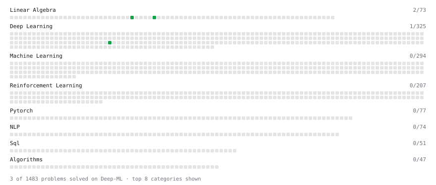

# Deep-ML

My machine learning practice from [Deep-ML](https://www.deep-ml.com). Every solution here was written by hand.

**2** solved · 1 problems · 0 labs · 1 math

[**Browse the interactive portfolio**](https://ahchoux.github.io/deep-ml/) to replay this filling in over time.

## Problems

| | Difficulty | Solved | |
| --- | --- | --- | --- |
| [Embedding Layer as One-Hot Matrix Multiplication](https://www.deep-ml.com/problems/947) | easy | 2026-09-22 | [solution](problems/0947-embedding-layer-as-one-hot-matrix-multiplication) |

## Math

| | Difficulty | Solved | |
| --- | --- | --- | --- |
| [Vector Norms and Linear Independence](https://www.deep-ml.com/math-problems/8) | medium | 2026-09-30 | [solution](math/0008-vector-norms-and-linear-independence) |

---

_This file is regenerated by Deep-ML on every push._
